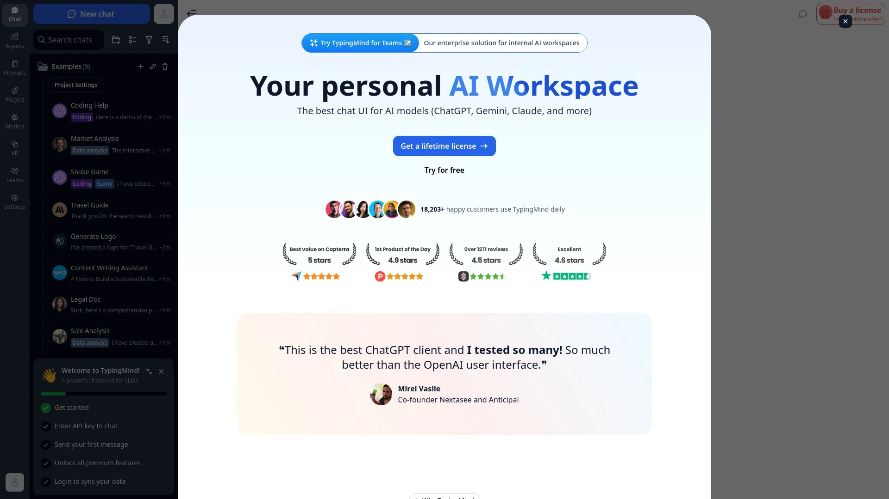
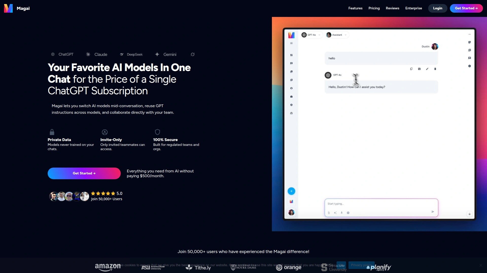
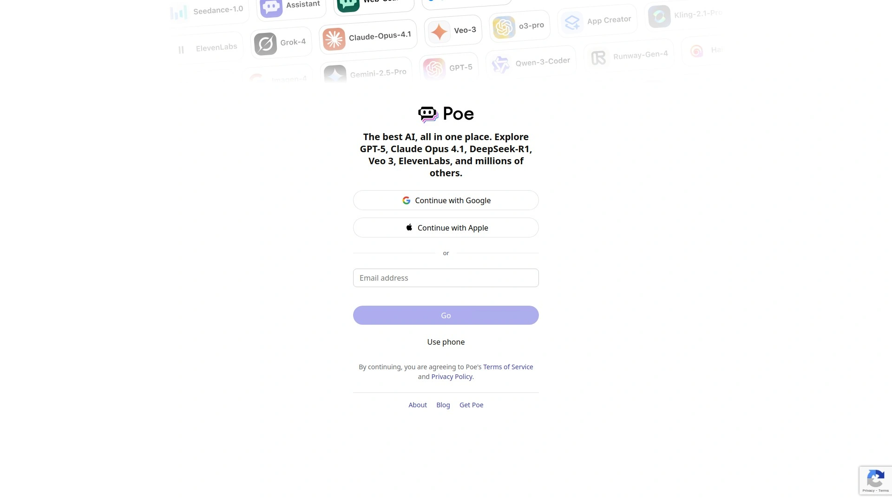
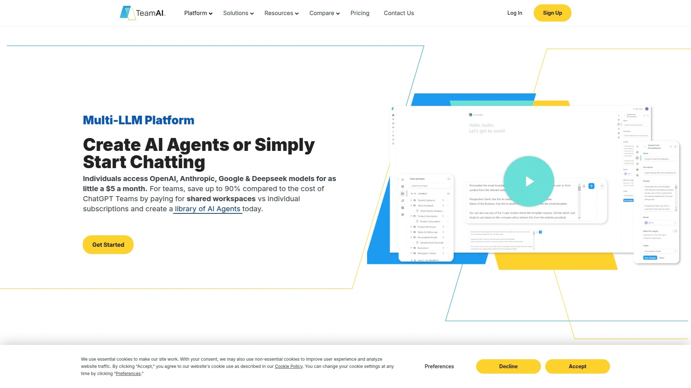
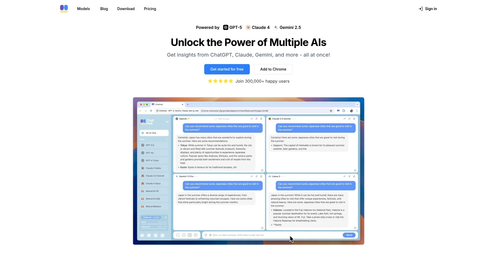
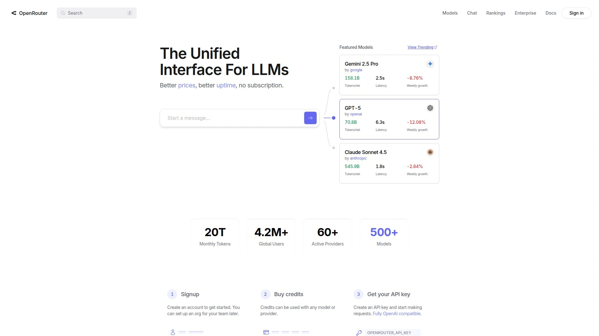
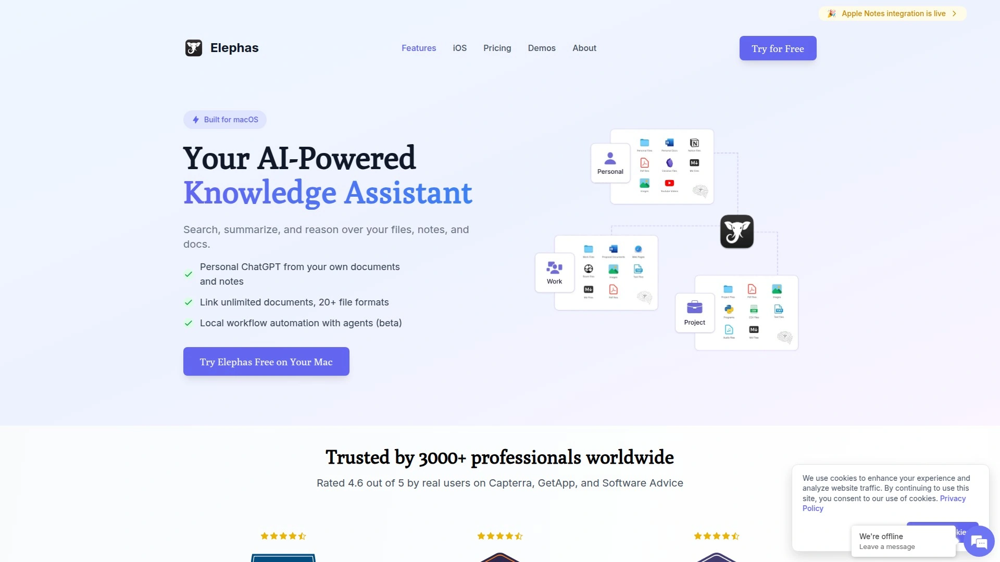
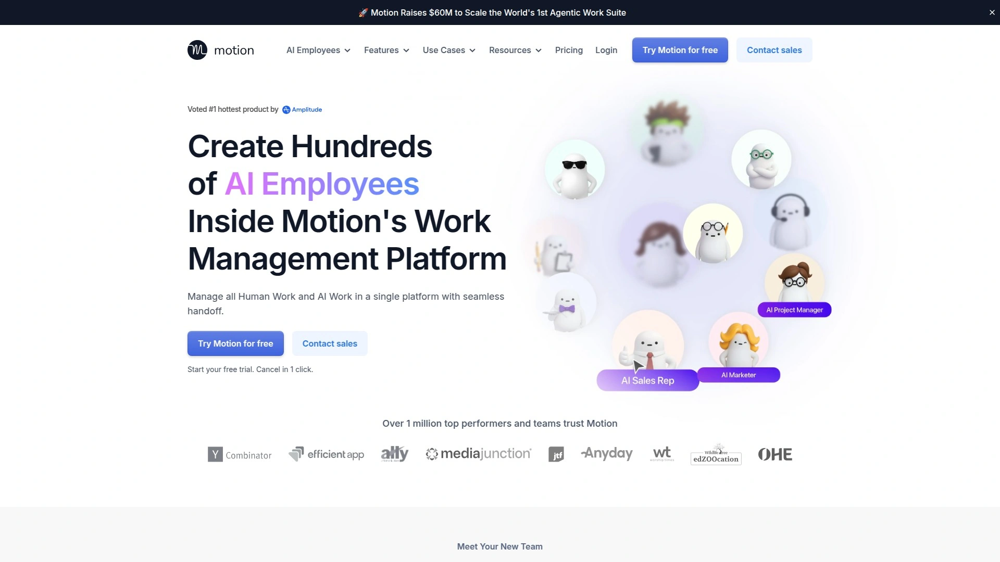
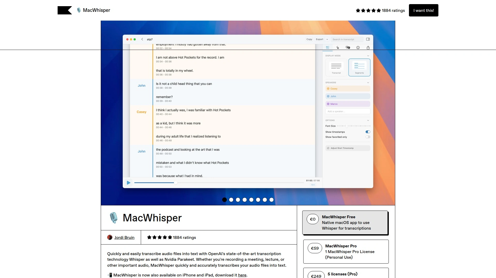

# 2025's Top 13 Best Multi-Model AI Assistant Tools

Switching between ChatGPT, Claude, and Gemini tabs all day gets exhausting fast. You're copying prompts, losing context between conversations, and wondering which AI actually gives you the best answer for what you're working on right now. Managing multiple subscriptions and API keys turns into its own full-time job, and you're still not getting the comparison results you need to make smart decisions about which model handles your specific tasks better.

Multi-model AI platforms solve this chaos by bringing every major language model into one interface. You can test the same prompt across different AIs simultaneously, switch models mid-conversation, and stop paying for three separate subscriptions when one unified workspace handles everything. These tools deliver faster workflows, better output quality through comparison, and substantial cost savings for anyone serious about AI productivity.

---

## **[Thinkbuddy](https://thinkbuddy.ai)**

Native MacOS interface unifying all major AI models with voice and screenshot capabilities.

Thinkbuddy transforms how Mac users interact with AI by creating a single command center for ChatGPT, Claude, Gemini, and other leading models. Unlike browser-based tools requiring constant tab switching, Thinkbuddy integrates directly into MacOS with customizable keyboard shortcuts that bring AI assistance anywhere you're working. Select text in any application, hit your shortcut, and instantly get responses from your preferred model without breaking focus.

The voice input feature powered by OpenAI's Whisper handles dictation in any language, eliminating typing fatigue during long writing sessions. Screenshot capture lets you ask questions about what's on your screen—perfect for debugging code, understanding complex diagrams, or getting help with software interfaces. The intelligent clipboard paste feature keeps interactions clutter-free by automatically handling copy-paste workflows.

Unlimited model switching at the prompt level means you can use Claude for analytical tasks, GPT-4o for creative writing, and Gemini for research without paying separate subscriptions for each. Custom prompts save your frequently used instructions for instant reuse. The platform offsets costs for basic users through paid subscriptions, making it accessible with a free tier that actually works for daily use. For Mac users wanting seamless AI integration that feels native rather than bolted-on, Thinkbuddy delivers the most polished experience available.

***

## **[TypingMind](https://www.typingmind.com)**

Advanced chat interface supporting 35+ models with parallel conversations and custom parameters.

TypingMind gives you control over AI interactions most platforms hide behind simplified interfaces. The multi-model parallel chat feature runs identical prompts across GPT-4o, Claude, Gemini, and dozens of other models simultaneously, displaying responses side-by-side for instant comparison. This approach reveals which AI handles your specific use case best—whether that's code generation, creative writing, or technical analysis.

Each model maintains separate conversation threads, so follow-up questions stay contextually accurate for every AI independently. You can select a primary response if one model outperforms others, then continue the conversation using that context while still generating new responses from all active models. The finalize mode merges insights from multiple models into single polished outputs combining their collective strengths.

Custom parameter controls let you adjust temperature, top P, presence penalty, and reasoning effort for each model individually. OpenAI-compatible API endpoints mean unlimited model additions as long as they follow standard formats. One-time purchase options avoid recurring subscriptions while maintaining full functionality. For developers and power users wanting maximum flexibility and technical control, TypingMind delivers capabilities other platforms simplify away.

***

## **[Magai](https://magai.co)**

Unified workspace accessing 50+ AI applications with team collaboration features.

Magai consolidates access to major language models, image generators, and specialized AI tools under one subscription. Switch between models mid-conversation without losing context or starting over. Reuse GPT instructions across different models, maintaining consistency in how you interact with various AIs. The collaborative workspace lets teams share conversations, prompts, and outputs directly rather than emailing screenshots or copying text between tools.

Brand voice features help maintain consistent tone across all AI-generated content, crucial for businesses needing uniform communication. Document chat functionality allows conversations with uploaded files, extracting information and answering questions about PDFs, spreadsheets, and other formats. Web browsing integration gives models access to current information beyond their training data cutoffs.

The pricing model replaces multiple separate subscriptions with single comprehensive access. Teams avoid the administrative headache of managing individual accounts across numerous AI platforms. For businesses and collaborative teams needing centralized AI access with shared resources and consistent outputs, Magai provides organizational structure most consumer-focused platforms lack.

***

## **[Poe](https://poe.com)**

Quora-built platform offering instant access to newest models plus custom bot creation.

Poe democratizes access to cutting-edge AI models including o3, GPT-4.5, Claude 3.7, and Gemini 2.0 through a single clean interface. The platform excels at rapid deployment of new models—often adding them within days of public release. Cross-device compatibility means seamless switching between desktop and mobile without losing conversation context.

The custom bot ecosystem includes over one million user-created assistants specialized for specific tasks like language learning, code review, and document analysis. Creating your own bot takes under a minute, with options to add custom knowledge bases for more unique experiences. Multimedia generation integrates FLUX1.1, Runway, and other leading creative AI tools alongside text models.

File chat capabilities let you upload PDFs and images for direct interaction—highlighting text in documents for AI analysis or asking questions about visual content. The AI-powered search engine combines natural language processing with web access for current information retrieval. Free tier access remains generous, with paid subscriptions unlocking unlimited usage during peak times. For users wanting early access to newest models and extensive bot customization, Poe delivers both breadth and depth.

***

## **[TeamAI](https://teamai.com)**

Business-focused workspace centralizing Gemini, DeepSeek, and OpenAI for team collaboration.

TeamAI consolidates AI spending by replacing scattered individual accounts with unified team access. Companies stop managing separate ChatGPT, Claude, and Gemini subscriptions for each employee, simplifying billing and access control. Workflow automation capabilities connect AI models to business processes, triggering actions based on AI outputs or feeding data from company systems into model prompts.

Administrative controls give managers visibility into usage patterns, costs per team member, and which models perform best for different departments. Shared prompt libraries ensure consistent AI interactions across teams, preventing quality variations from everyone writing their own instructions. Scalable pricing grows with headcount without requiring constant subscription adjustments.

Knowledge bases integrate company documents and data, allowing AI models to reference proprietary information when generating responses. This contextualization produces outputs aligned with internal standards and informed by institutional knowledge. For enterprises needing centralized AI access with governance, cost control, and business-specific customization, TeamAI addresses organizational requirements consumer platforms ignore.

***

## **[ChatHub](https://chathub.gg)**

Browser extension enabling simultaneous conversations with six AI models side-by-side.

ChatHub operates as a lightweight browser extension rather than standalone application, integrating directly into your existing workflow. The six-model simultaneous chat layout displays responses from ChatGPT, Claude, Gemini, Llama, and others in parallel columns for instant comparison. This visual format makes differences in response quality, style, and accuracy immediately obvious without mental effort switching between tabs.

Three authentication methods accommodate different needs: use existing browser logins for services like ChatGPT Plus to leverage your paid privileges directly within ChatHub, enter API keys for pay-as-you-go access ensuring stability, or subscribe to ChatHub's ready-to-use AI service accessing 20+ models without individual setups. The prompt library manages frequently used instructions for quick reuse across sessions.

Local chat history saves conversations in your browser with full-text search, maintaining privacy while enabling easy retrieval of past interactions. Smart web access enhances responses by pulling current information from the internet when needed. Dark mode and markdown support with code highlighting improve readability for technical work. For users wanting simple multi-model access without installing dedicated applications, ChatHub provides powerful functionality in familiar browser environments.

***

## **[OpenRouter](https://openrouter.ai)**

Unified API gateway providing access to 400+ models through single integration.

OpenRouter serves developers and technical users needing programmatic access to multiple AI models without managing dozens of API keys. One OpenRouter key unlocks GPT-4, Claude, Llama, Mistral, and hundreds of other models through standardized API format. This architectural approach means writing code once and switching models by changing a single parameter rather than rewriting integrations for each provider.

Transparent real-time pricing shows exact costs per request, enabling informed decisions about which model offers best value for specific use cases. Automatic failover and load balancing maintain uptime even when individual models experience outages or rate limits. Detailed analytics track model performance, latency, and cumulative costs across all usage.

Free model access includes genuinely capable options for testing and development without financial commitment. Pay-as-you-go billing means no monthly subscriptions—you're charged only for actual usage. For developers building AI features into applications or power users comfortable with APIs wanting cost-effective access to maximum model variety, OpenRouter delivers technical infrastructure consumer-focused platforms can't match.

***

## **[Elephas](https://elephas.app)**

Mac-native personal knowledge assistant with offline capabilities and Super Brain technology.

Elephas distinguishes itself through offline functionality using locally installed AI models, ensuring data stays on your machine while maintaining fast response times. The Super Brain feature creates personalized knowledge bases learning from your documents, notes, and interactions to provide increasingly relevant suggestions over time. Smart notes system captures web content, PDFs, and ideas in structured formats making retrieval effortless.

Model selection flexibility lets you choose between different AI providers based on task requirements—using faster models for quick queries and more capable ones for complex analysis. Web search integration streams research capabilities directly into the app without external browser searches. Advanced writing tools adapt to your style preferences, maintaining voice consistency across projects.

Deep Mac integration means Elephas works system-wide across applications rather than requiring you to work inside yet another window. At $8.99 monthly, pricing undercuts ChatGPT Plus while delivering Mac-specific optimizations and privacy-first offline capabilities. For Mac users prioritizing data privacy, personalized learning, and native performance, Elephas combines technical sophistication with practical convenience.

---

## **[Raycast](https://www.raycast.com)**

Spotlight replacement with integrated AI capabilities and extensive automation extensions.

Raycast transforms Mac's command launcher into an AI-powered productivity hub. The Option+Space shortcut brings instant AI access from any application—select text, invoke Raycast, and run commands like "Improve Writing" or "Fix Spelling" without opening separate apps. Voice transcription, translation, OCR, and web search execute through simple keyboard shortcuts maintaining focus rather than breaking workflow.

Extensive extension ecosystem adds hundreds of integrations connecting AI to development tools, project management systems, and productivity apps. Custom workflows combine AI commands with automated actions, like generating meeting summaries and sending them to project management tools automatically. Raycast Notes provides quick capture synchronized across devices for users on Pro plans.

The upcoming custom keyboard for iOS promises similar convenience on mobile, though currently the share extension and shortcuts provide workaround solutions. Free tier delivers substantial functionality, with Pro unlocking cross-device sync and advanced features. For Mac power users already using productivity shortcuts and wanting AI capabilities integrated into existing workflows rather than adding separate applications, Raycast delivers cohesive automation.

***

## **[ChatGPT Mac App](https://chatgpt.com)**

OpenAI's native application bringing text, voice, vision, and coding assistance to Mac desktops.

The official ChatGPT Mac app combines multimodal capabilities in polished native software optimized for Apple Silicon. Agent mode performs autonomous tasks including research and code execution rather than just responding to prompts. Canvas mode transforms writing and coding into collaborative experiences where AI suggests improvements in real-time alongside your work.

Option+Space global shortcut provides instant access from anywhere without switching applications. Voice conversations enable natural dialogue for brainstorming, research, or problem-solving while multitasking. Vision capabilities analyze screenshots, diagrams, and uploaded images for contextual assistance. GPT-4o and o1 models handle everything from casual conversation to advanced technical analysis.

Regular updates introduce cutting-edge capabilities as OpenAI releases new models and features. Free tier allows meaningful daily usage, though paid plans unlock priority access and higher limits. For users wanting comprehensive AI assistance from the leading research company with seamless Mac integration, the official app delivers refinement third-party alternatives can't replicate.

***

## **[Claude Mac App](https://claude.ai)**

Anthropic's reasoning-focused assistant with native Mac design and safety-first responses.

Claude excels at tasks requiring nuanced understanding and detailed analysis—research synthesis, content evaluation, and situations where accuracy matters more than speed. The Mac-native interface follows Apple design principles with keyboard shortcuts feeling natural to Mac users. Safety-focused training produces fewer inappropriate responses and more reliable information for professional contexts.

Deep contextual understanding enables Claude to reason through complex problems maintaining thread across lengthy conversations. Document analysis capabilities extract insights from uploaded PDFs, comparing viewpoints and providing balanced perspectives on multifaceted topics. The app handles technical writing, code review, and strategic planning with particular effectiveness.

Response times run slower than some competitors, reflecting Anthropic's emphasis on considered outputs over rapid generation. Conservative approach to creative tasks prioritizes safety, occasionally limiting imaginative responses. For professionals prioritizing accuracy, ethical AI behavior, and thorough analysis over speed, Claude's strengths align with serious work requirements.

***

## **[Motion](https://usemotion.com)**

Comprehensive AI productivity suite combining project management with autonomous task handling.

Motion goes beyond conversational AI into autonomous workflow management. AI automatically creates, assigns, and prioritizes tasks while balancing thousands of parameters including deadlines, dependencies, and team capacity. The integrated calendar schedules meetings and plans daily activities without manual intervention. AI notes take perfect meeting transcriptions, summarize discussions, and extract action items automatically.

AI projects generate complete project plans in seconds and maintain status updates autonomously, saving hours weekly on administrative work. The docs feature drafts or edits documents through conversational interface. SOPs transform into immediate workflows and project plans. Built-in search finds anything across docs, notes, projects, and tasks while answering business questions from aggregated data.

This comprehensive approach replaces multiple separate productivity tools with unified AI-powered workspace. Teams gain capacity insights, realistic project completion timelines, and actual actionable dashboards rather than vanity metrics. For businesses wanting AI that actively manages work rather than just answering questions, Motion delivers operational automation beyond typical chatbot capabilities.

***

## **[MacWhisper](https://goodsnooze.gumroad.com/l/macwhisper)**

Privacy-first local transcription powered by OpenAI's Whisper running entirely offline.

MacWhisper transforms audio into text completely locally on your Mac without cloud services—perfect for confidential meetings, sensitive content, or users prioritizing data privacy. OpenAI's Whisper model handles multilingual transcription with high accuracy across dozens of languages. Files process quickly on modern Apple Silicon chips without uploading anything externally.

The straightforward interface focuses on core transcription functionality without bloat—drag audio files in, get accurate text out. Export options include standard formats for use in other applications. Offline operation means transcription works anywhere without internet connectivity or recurring costs after initial purchase.

Limited to audio transcription rather than being full AI assistant, so it serves specific use case exceptionally well rather than attempting everything. One-time purchase pricing avoids subscription fatigue. For users needing reliable transcription with absolute privacy guarantees or frequent offline work, MacWhisper delivers focused capability with complete data control.

***

## FAQ

**Do these multi-model platforms actually save money compared to separate subscriptions?**

Yes, significantly. Individual ChatGPT Plus and Claude Pro subscriptions cost $20 each monthly, totaling $40+ for just two models. Platforms like Magai and TypingMind provide access to dozens of models for $15-25 monthly, while OpenRouter's pay-as-you-go often costs under $5 for typical usage. The savings compound when you need three or more models regularly.

**Can I use my existing ChatGPT Plus account within these platforms?**

Some platforms like ChatHub leverage your existing browser logins, automatically using your ChatGPT Plus privileges within their interface. Others like TypingMind and OpenRouter require separate API keys or their own subscriptions. Check each platform's authentication methods to determine which approach works for your situation and existing investments.

**Which platform works best for comparing model outputs side-by-side?**

ChatHub and TypingMind excel at visual side-by-side comparison with up to six models displaying responses simultaneously in parallel columns. This layout makes quality differences immediately obvious. Poe and Thinkbuddy handle model switching smoothly but show responses sequentially. Choose based on whether you need constant comparison or just flexible model selection.

---

## Wrapping This Up

The right multi-model platform depends on whether you prioritize native desktop integration, browser convenience, developer APIs, or comprehensive productivity features beyond chat. Most users benefit from tools offering true parallel comparison and seamless model switching rather than just consolidated access. For Mac users specifically wanting AI assistance that feels native to the operating system with voice commands, screenshot analysis, and system-wide shortcuts, [Thinkbuddy](https://thinkbuddy.ai) delivers the most integrated experience—turning every major AI model into instantly accessible tools rather than separate web applications requiring constant context switching. The combination of unlimited model switching, intelligent clipboard handling, and custom prompt libraries transforms AI from occasional reference tool into continuous productivity partner throughout your workday.
